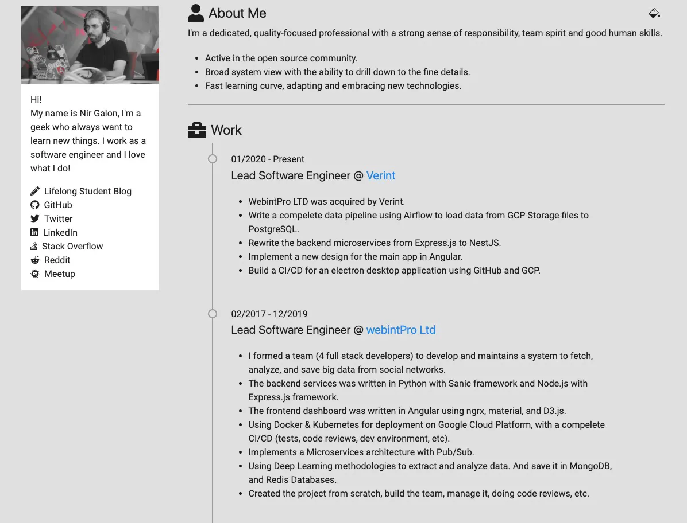

# devRes Theme

[](http://creativecommons.org/licenses/by/4.0/) [](https://github.com/nirgn975/devRes/releases)  [](https://gohugo.io/) [](https://www.paypal.me/nirgn/2)

> A Hugo resume theme with a Developer focus in mind.



# Getting started

If you want to use the theme in your own [hugo](https://gohugo.io) website just `clone` the repo to your `theme` directory and add it to your `config.toml` file.

```toml
theme = "devRes"
```

# Features

- Responsive layout.
- Light / Dark mode.
- Generate GitHub project cards automatically from a repo name.
- Automagically get the latest posts from your blog.
- Use [Font Awesome](https://fontawesome.com) or [Devicons](https://devicon.dev) icons.
- Support [Google Analytics](https://analytics.google.com/analytics) and [Plausible](https://plausible.io) analytics.
- Optimized for performance: 86/100 on mobile and 99/100 on desktop in [Google PageSpeed Insights](https://developers.google.com/speed/pagespeed/insights).
- **CDN** for all third-party libraries supported

# Customization

1. You can change the theme colors in the `config.toml` file.
2. Your resume data should be added in the `data/content.yaml` file.

You can check the `exampleSite` directory for an example.

# Want to help?

Great! All issues and pull requests are welcome.

For local development just copy all the files to the `exampleSite` directory, navigate to it and just start [hugo](https://gohugo.io) with

```bash
$ hugo server --source=exampleSite -v --gc
```
