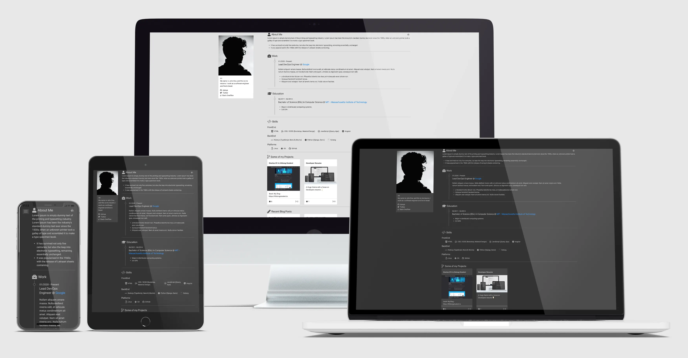

# devRes Theme

Something about the theme.

# Features

  foo

# How to use it

  bar

# Customization

  - You can change the theme colors in the `config.toml` file.
  - Your resume data should be added in the `data/content.yaml`.

# Contributing

Post bugs and contributions to the issue tracker. Or make a pull request.
